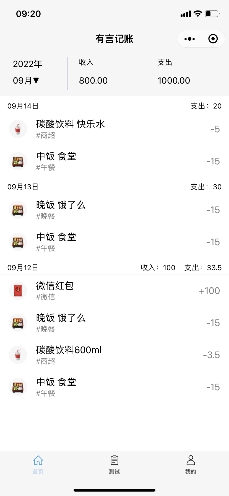
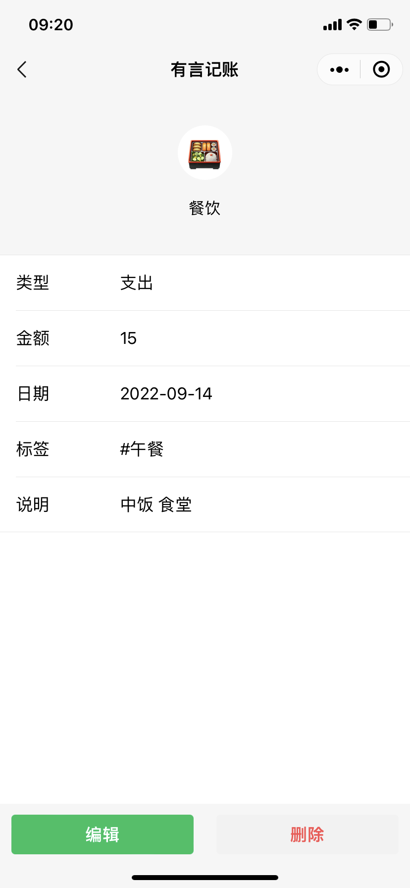
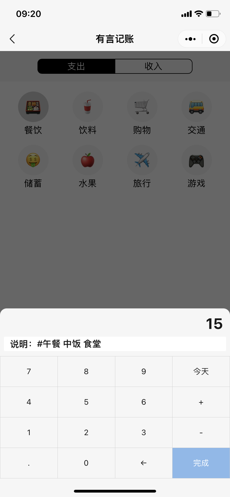

# 有言记账 微信小程序

## 技术依赖

- [微信开发者工具](https://developers.weixin.qq.com/miniprogram/dev/devtools/devtools.html)
- [WeUI组件库](https://wechat-miniprogram.github.io/weui/docs/)

## 功能页面

- [x] 用户授权登陆
- [x] 账单首页：按月查询
- [x] 账单详情页面
- [x] 账单编辑页面：分类选择、金额输入键盘、说明输入
- [x] 个人信息页面
- [x] 个人信息编辑页面：昵称修改
- [ ] 分类信息编辑页面
- [ ] 账单统计展示页面

## 功能接口对接

- [x] 用户登陆状态查询
- [x] 微信用户登陆注册
- [x] 用户信息查询
- [x] 用户信息修改
- [ ] 账单按月查询
- [ ] 账单新增
- [ ] 账单编辑

## 页面效果展示

| 账单首页                      | 个人页面                     | 个人信息修改                          |
|---------------------------|--------------------------|---------------------------------|
|  |  |  |

| 账单详情                            | 账单编辑                          | 账单编辑                                   |
|---------------------------------|-------------------------------|----------------------------------------|
|  |  |  |

